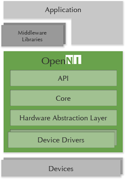

# API

## API Architecture



The OpenNI2 framework provides two sets of software interfaces at its core:

1.Application layer interface.For application layer developers, the differences in 3D sensors from different manufacturers are shielded.

2.Driver layer interface.As long as the 3D Sensor that implements the driver layer interface complies with the OpenNI2 protocol, it can access the device from the OpenNI2 application layer interface.

The OpenNI2 framework has a significant hierarchy.All API interfaces are implemented in strict accordance with this hierarchy.When you look at the code with this hierarchy in mind, it becomes clear.

OpenNI2 dynamically loads the device Driver through the Driver Handler module.The advantage of this is that you can separate the OpenNI2 code from the driver of the 3D Sensor and develop and maintain it as two separate projects.


## API How-To C++


### Hello World

Want to get a taste of our SDK before diving depther? Then let's get our hands dirty and write some code!

By the end of this tutorials you should be familiar with：

1.Initialization and termination of the SDK.

2.Reading data from the sensor.

3.Examining the depth information provided by the Astra's depth camera.

#### Before We Begin

If you skipped over the section where we install the SDK and build the sample applications provided by the SDK, make sure you've at least downloaded and extracted OpenNI2 SDK to a folder you can easily access.

#### Getting Down to Business

Our first step will be to set up a basic application as a starting point for progressively adding new functionality. 
1.Using your favorite IDE, set up a new console application project and create a new source file called "main.cpp". 

2.Copy the following into your main.cpp file:


```
#include <OpenNI.h>

#include <stdio.h>
#include <cstdio>
#include <iostream>

int main(int argc, char** argv)
{
   std::cout << "hit enter to exit program" << std::endl;
   system("pause");

   return 0;
}
```

-   OpenNI.h must be included in all applications. It is the core of OpenNI2 SDK and is required for all C++ based OpenNI2 applications.
-   We'll use system("pause") to make sure we have an opportunity to see our handiwork before our application closes its window.

#### Initializing and Terminating OpenNI

To prepare OpenNI2 to do our bidding, we must first initialize OpenNI2, which is unsurprisingly done via the initialize() function. When we're ready to end our session with the SDK, we then need to give OpenNI2 an opportunity to cleanly shutdown. This is accomplished by calling the terminate function shutdown() .
Add the two new lines below:

```
int main(int argc, char** argv)
{
    Status rc = OpenNI::initialize();
    if (rc != STATUS_OK)
    {
        printf("Initialize failed\n%s\n", OpenNI::getExtendedError());
        return 1;
    }

   // what will go here? you'll find out soon!

   	OpenNI::shutdown();

   std::cout << "hit enter to exit program" << std::endl;
   system("pause");

   return 0;
}
```

#### Trust But Verify

Before we get ahead of ourselves, let's take a moment to make sure that everything is as we expect it. Compile and run the application. The application should start up, print out a series of diagnostic messages to the console, and then patiently wait for you to press the "Enter" key. Once pressed, the application should gracefully exit. 

> **Attention**  
> OpenNI2 by default logs a fair amount of diagnostic information to the console. If you do run into an issue, this can be a great place to start looking for answers. Next up: Talking to OpenNI2.

#### Connecting to the OpenNI2-Open Device

Now that we know how to properly initialize and terminate OpenNI2, it's time to actually communicate with the OpenNI2 sensor.To do this, we use the Device class, which is an abstraction of a Device and provides the ability to connect to a Device and get configuration information about the Device and the kind of flow it supports.For now, however, we can think of Device as a physical Device and use it to control the Device.

Between initializing and terminating OpenNI2, we declare a Device variable.

```
int main(int argc, char** argv)
{
    Status rc = OpenNI::initialize();
    if (rc != STATUS_OK)
    {
        printf("Initialize failed\n%s\n", OpenNI::getExtendedError());
        return 1;
    }

   	Device device;
    rc = device.open(ANY_DEVICE);
    if (rc != STATUS_OK)
    {
        printf("Couldn't open device\n%s\n", OpenNI::getExtendedError());
        return 2;
    }

    device.close();
    OpenNI::shutdown();

    std::cout << "hit enter to exit program" << std::endl;
    system("pause");

    return 0;
}
```

Now, to be sure, it looks like we've added a few lines of code to the previous step, but those lines are much more important than it looks.Simply by declaring and constructing a Device object and calling the open method of the Device object, you can instruct OpenNI2 to start connecting to the first available OpenNI2 sensor it can locate.

> **Attention**  
>
> OpenNI2 provides an additional constructor that will allow you to connect to a specific OpenNI2 sensor.

#### Retrieving Sensor Data

Time to put our Device object to good use and get some data. To do this, we'll need to read one of the streams that the OpenNI2 is providing. Streams contain the data coming from our camera packaged in packets of data called "frames". OpenNI2 currently supports a number of types of streams, including depth, color, hand, and point streams.

In order to access streams from the OpenNI2 and get to the frames, we'll need a VideoStream to tap into one of the streams. For the purposes of our application,we're going to focus on the depth stream. This stream gives us the distances of anything that our camera sees in pixels, and those pixels are packaged in a frame.

First, let's create a VideoStream using our Device.

```
int main(int argc, char** argv)
{
    Status rc = OpenNI::initialize();
    if (rc != STATUS_OK)
    {
        printf("Initialize failed\n%s\n", OpenNI::getExtendedError());
        return 1;
    }

   	Device device;
    rc = device.open(ANY_DEVICE);
    if (rc != STATUS_OK)
    {
        printf("Couldn't open device\n%s\n", OpenNI::getExtendedError());
        return 2;
    }

    VideoStream depth;

    if (device.getSensorInfo(SENSOR_DEPTH) != NULL)
    {
        rc = depth.create(device, SENSOR_DEPTH);
        if (rc != STATUS_OK)
        {
            printf("Couldn't create depth stream\n%s\n", OpenNI::getExtendedError());
            return 3;
        }
    }

    depth.destroy();
    device.close();
    OpenNI::shutdown();

    std::cout << "hit enter to exit program" << std::endl;
    system("pause");

    return 0;
}
```

Next, we'll use the VideoStream depth we created in the next step to start the depth stream and get the depth data.

```
int main(int argc, char** argv)
{
    Status rc = OpenNI::initialize();
    if (rc != STATUS_OK)
    {
        printf("Initialize failed\n%s\n", OpenNI::getExtendedError());
        return 1;
    }

   	Device device;
    rc = device.open(ANY_DEVICE);
    if (rc != STATUS_OK)
    {
        printf("Couldn't open device\n%s\n", OpenNI::getExtendedError());
        return 2;
    }

    VideoStream depth;

    if (device.getSensorInfo(SENSOR_DEPTH) != NULL)
    {
        rc = depth.create(device, SENSOR_DEPTH);
        if (rc != STATUS_OK)
        {
            printf("Couldn't create depth stream\n%s\n", OpenNI::getExtendedError());
            return 3;
        }
    }
    
    rc = depth.start();
    if (rc != STATUS_OK)
    {
        printf("Couldn't start the depth stream\n%s\n", OpenNI::getExtendedError());
        return 4;
    }
    
    depth.stop();
    depth.destroy();
    device.close();
    OpenNI::shutdown();

    std::cout << "hit enter to exit program" << std::endl;
    system("pause");

    return 0;
}
```

We first need to retrieve the latest frame via VideoStream, and then call getData to get the depth frame data from our frame.

```
int main(int argc, char** argv)
{
    Status rc = OpenNI::initialize();
    if (rc != STATUS_OK)
    {
        printf("Initialize failed\n%s\n", OpenNI::getExtendedError());
        return 1;
    }

   	Device device;
    rc = device.open(ANY_DEVICE);
    if (rc != STATUS_OK)
    {
        printf("Couldn't open device\n%s\n", OpenNI::getExtendedError());
        return 2;
    }

    VideoStream depth;

    if (device.getSensorInfo(SENSOR_DEPTH) != NULL)
    {
        rc = depth.create(device, SENSOR_DEPTH);
        if (rc != STATUS_OK)
        {
            printf("Couldn't create depth stream\n%s\n", OpenNI::getExtendedError());
            return 3;
        }
    }
    
    rc = depth.start();
    if (rc != STATUS_OK)
    {
        printf("Couldn't start the depth stream\n%s\n", OpenNI::getExtendedError());
        return 4;
    }
    
    int changedStreamDummy;
    VideoStream* pStream = &depth;
    rc = OpenNI::waitForAnyStream(&pStream, 1, &changedStreamDummy, SAMPLE_READ_WAIT_TIMEOUT);
    if (rc != STATUS_OK)
    {
        printf("Wait failed! (timeout is %d ms)\n%s\n", SAMPLE_READ_WAIT_TIMEOUT, OpenNI::getExtendedError());
        continue;
    }

    rc = depth.readFrame(&frame);
    if (rc != STATUS_OK)
    {
        printf("Read failed!\n%s\n", OpenNI::getExtendedError());
        continue;
    }

    if (frame.getVideoMode().getPixelFormat() != PIXEL_FORMAT_DEPTH_1_MM && frame.getVideoMode().getPixelFormat() != PIXEL_FORMAT_DEPTH_100_UM)
    {
        printf("Unexpected frame format\n");
        continue;
    }

    DepthPixel* pDepth = (DepthPixel*)frame.getData();

    depth.stop();
    depth.destroy();
    device.close();
    OpenNI::shutdown();

    std::cout << "hit enter to exit program" << std::endl;
    system("pause");

    return 0;
}

```

The obtained depth data is then printed out.

```
int main(int argc, char** argv)
{
    Status rc = OpenNI::initialize();
    if (rc != STATUS_OK)
    {
        printf("Initialize failed\n%s\n", OpenNI::getExtendedError());
        return 1;
    }

   	Device device;
    rc = device.open(ANY_DEVICE);
    if (rc != STATUS_OK)
    {
        printf("Couldn't open device\n%s\n", OpenNI::getExtendedError());
        return 2;
    }

    VideoStream depth;

    if (device.getSensorInfo(SENSOR_DEPTH) != NULL)
    {
        rc = depth.create(device, SENSOR_DEPTH);
        if (rc != STATUS_OK)
        {
            printf("Couldn't create depth stream\n%s\n", OpenNI::getExtendedError());
            return 3;
        }
    }
    
    rc = depth.start();
    if (rc != STATUS_OK)
    {
        printf("Couldn't start the depth stream\n%s\n", OpenNI::getExtendedError());
        return 4;
    }
    
    int changedStreamDummy;
    VideoStream* pStream = &depth;
    rc = OpenNI::waitForAnyStream(&pStream, 1, &changedStreamDummy, SAMPLE_READ_WAIT_TIMEOUT); 
    if (rc != STATUS_OK)
    {
        printf("Wait failed! (timeout is %d ms)\n%s\n", SAMPLE_READ_WAIT_TIMEOUT, OpenNI::getExtendedError());
        return 5;
    }

    rc = depth.readFrame(&frame);
    if (rc != STATUS_OK)
    {
        printf("Read failed!\n%s\n", OpenNI::getExtendedError());
        return 6;
    }

    if (frame.getVideoMode().getPixelFormat() != PIXEL_FORMAT_DEPTH_1_MM && frame.getVideoMode().getPixelFormat() != PIXEL_FORMAT_DEPTH_100_UM)
    {
        printf("Unexpected frame format\n");
        return 7;
    }

    DepthPixel* pDepth = (DepthPixel*)frame.getData();
    
    int middleIndex = (frame.getHeight() + 1)*frame.getWidth() / 2;

    printf("[%08llu] %8d\n", (long long)frame.getTimestamp(), pDepth[middleIndex]);

    depth.stop();
    depth.destroy();
    device.close();
    OpenNI::shutdown();

    std::cout << "hit enter to exit program" << std::endl;
    system("pause");

    return 0;
}

```

Finally, run your application to check that everything is ok.Normally, the console window that pops up prints a line of captured data frames.When the run is complete, press enter.

We showed you how to get a frame of data from an OpenNI2 device! Next we'll learn how to deal with a series of frames.

#### Get stream data (a series of data frames)

Just loop through the VideoStream's readFrame function to use the data stream.In the following example, we will take the first 100 frames from the depth stream and print the first pixel value of each frame to the console.

The following code is very similar to the code in our previous example, except that in addition to adding a do while loop outside the frame handling code, we also added variables to store the number of loops and the maximum number of frames we want to process.

```

int main(int argc, char** argv)
{
    Status rc = OpenNI::initialize();
    if (rc != STATUS_OK)
    {
        printf("Initialize failed\n%s\n", OpenNI::getExtendedError());
        return 1;
    }

   	Device device;
    rc = device.open(ANY_DEVICE);
    if (rc != STATUS_OK)
    {
        printf("Couldn't open device\n%s\n", OpenNI::getExtendedError());
        return 2;
    }

    VideoStream depth;

    if (device.getSensorInfo(SENSOR_DEPTH) != NULL)
    {
        rc = depth.create(device, SENSOR_DEPTH);
        if (rc != STATUS_OK)
        {
            printf("Couldn't create depth stream\n%s\n", OpenNI::getExtendedError());
            return 3;
        }
    }
    
    rc = depth.start();
    if (rc != STATUS_OK)
    {
        printf("Couldn't start the depth stream\n%s\n", OpenNI::getExtendedError());
        return 4;
    }
    
    int changedStreamDummy;
    VideoStream* pStream = &depth;
    
   //Stores the maximum number of frames we're going to process in the loop
   const int maxFramesToProcess = 100;
   //Sentinel to count the number of frames that we've processed
   int count = 0;

   //The frame processing loop
    do{
        rc = OpenNI::waitForAnyStream(&pStream, 1, &changedStreamDummy, SAMPLE_READ_WAIT_TIMEOUT); 
        if (rc != STATUS_OK)
        {
            printf("Wait failed! (timeout is %d ms)\n%s\n", SAMPLE_READ_WAIT_TIMEOUT, OpenNI::getExtendedError());
            continue;
        }

        rc = depth.readFrame(&frame);
        if (rc != STATUS_OK)
        {
            printf("Read failed!\n%s\n", OpenNI::getExtendedError());
            continue;
        }

        if (frame.getVideoMode().getPixelFormat() != PIXEL_FORMAT_DEPTH_1_MM && frame.getVideoMode().getPixelFormat() != PIXEL_FORMAT_DEPTH_100_UM)
        {
            printf("Unexpected frame format\n");
            continue;
        }

        DepthPixel* pDepth = (DepthPixel*)frame.getData();

        printf("[%08llu] %8d\n", (long long)frame.getTimestamp(), pDepth[0]);
        
        count++;
    }while (count < maxFramesToProcess);

    depth.stop();
    depth.destroy();
    device.close();
    OpenNI::shutdown();

    std::cout << "hit enter to exit program" << std::endl;
    system("pause");

    return 0;
}

```

Compile and run. While the program is running and the OpenNI2 is focused on you, move around a bit and watch the data values on the frames change.

Achievement get! You've just made your first OpenNI2 application! If you haven't had your fill of fun with OpenNI2 yet, continue on to Retrieving Stream Data.

### Retrieving Stream Data

#### Stream Types

The OpenNI2 SDK supports three data flow types.These data streams are generated by the sensor and passed through the SDK to the application.You can select the appropriate data flow according to your needs.


| Stream Type  | Description                                                  |
| ------------ | :----------------------------------------------------------- |
| SENSOR_COLOR | RGB pixel data from the sensor. The data array included in each ColorFrame contains values ranging from 0-255 for each color component of each pixel. Never start it when InfraredStream is started. |
| SENSOR_DEPTH | Depth data from the sensor. The data array included in each DepthFrame contains values in millimeters for each pixel within the sensor's field of view. |
| SENSOR_IR    | IR data from the sensor.                                     |

#### Getting the Data

Two methods are provided by the OpenNI2 SDK to get stream data. Depending on your particular use case and the complexity of your application, one method may be better suited than the other.

**Polling**


The polling method to get the frame data is the most direct way to get the stream data, and is used in the Hello World tutorial.To use this method, you simply call OpenNI::waitForAnyStream and read the stream data through the VideoStream::readFrame() method.If new data is generated, the readFrame() method provides a VideoFrameRef that can access the newly generated video frames.If no new frames are generated, the OpenNI::waitForAnyStream method blocks until a new frame is generated.If you want to limit the time the SDK waits for a new frame to arrive, you can pass the timeout as a Parameter to the OpenNI::waitForAnyStream function.

```
Status rc = OpenNI::initialize();
if (rc != STATUS_OK)
{
    printf("Initialize failed\n%s\n", OpenNI::getExtendedError());
    return 1;
}

Device device;
rc = device.open(ANY_DEVICE);
if (rc != STATUS_OK)
{
    printf("Couldn't open device\n%s\n", OpenNI::getExtendedError());
    return 2;
}

VideoStream depth;

if (device.getSensorInfo(SENSOR_DEPTH) != NULL)
{
    rc = depth.create(device, SENSOR_DEPTH);
    if (rc != STATUS_OK)
    {
        printf("Couldn't create depth stream\n%s\n", OpenNI::getExtendedError());
        return 3;
    }
}

rc = depth.start();
if (rc != STATUS_OK)
{
    printf("Couldn't start the depth stream\n%s\n", OpenNI::getExtendedError());
    return 4;
}

int changedStreamDummy;
VideoStream* pStream = &depth;
rc = OpenNI::waitForAnyStream(&pStream, 1, &changedStreamDummy, SAMPLE_READ_WAIT_TIMEOUT); 
if (rc != STATUS_OK)
{
    printf("Wait failed! (timeout is %d ms)\n%s\n", SAMPLE_READ_WAIT_TIMEOUT, OpenNI::getExtendedError());
    return 5;
}

rc = depth.readFrame(&frame);
if (rc != STATUS_OK)
{
    printf("Read failed!\n%s\n", OpenNI::getExtendedError());
    return 6;
}
```

**Event**

Getting frame data using an event-based approach requires a small amount of additional setup, but allows developers to delegate the processing of frames to one or more separate classes.OpenNI2 SDK provides a named VideoStream: : NewFrameListener abstract classes, this class implements a only called NewFrameListener: : onNewFrame function.Once the VideoStream stream has a data frame and ready to be processed, immediately call NewFrameListener: : onNewFrame function.

An example of a listener class derived from NewFrameListener:

```

class PrintCallback : public VideoStream::NewFrameListener
{
public:
    void onNewFrame(VideoStream& stream)
    {
    	stream.readFrame(&m_frame);
    }
private:
	VideoFrameRef m_frame;
};
```

Defines a listener class, in order to use it, must instantiate the listener in the application, and then use the VideoStream: : addNewFrameListener function will be added to the VideoStream.

Example use of listener:

```
Status rc = OpenNI::initialize();
if (rc != STATUS_OK)
{
    printf("Initialize failed\n%s\n", OpenNI::getExtendedError());
    return 1;
}

Device device;
rc = device.open(ANY_DEVICE);
if (rc != STATUS_OK)
{
    printf("Couldn't open device\n%s\n", OpenNI::getExtendedError());
    return 2;
}

VideoStream depth;

if (device.getSensorInfo(SENSOR_DEPTH) != NULL)
{
    rc = depth.create(device, SENSOR_DEPTH);
    if (rc != STATUS_OK)
    {
        printf("Couldn't create depth stream\n%s\n", OpenNI::getExtendedError());
        return 3;
    }
}

rc = depth.start();
if (rc != STATUS_OK)
{
    printf("Couldn't start the depth stream\n%s\n", OpenNI::getExtendedError());
    return 4;
}

PrintCallback depthPrinter;

// Register to new frame
depth.addNewFrameListener(&depthPrinter);

// Wait while we're getting frames through the printer
while (true)
{
    Sleep(100);
}
```

In fact, the while loop in the above code does not need to be executed all the time and needs to exit the loop when the application closes or another application-specific event occurs.

For a more practical example of a listener, continue reading the Event Based Read.

### Event Based Read Sample

Thirsting for more knowledge after finishing the Hello World Tutorial? Now that you've mastered some of the basic concepts of OpenNI2 SDK, let's read the depth stream from our OpenNI2 using another feature.

By the end of this tutorial you should be familiar with: 

* The purpose of the NewFrameListener class
* How to define a NewFrameListener 
* Using a NewFrameListener to process a depth stream.

Before We Begin 

1.Download and decompress the latest OpenNI2 SDK, if you haven't already. 

2.Using your favorite IDE, set up a new console application project and create a new source file called "main.cpp". 

3.Copy the following into yourmain.cpp file:

```
#include <stdio.h>
#include "OpenNI.h"

int main(int argc, char** argv)
{
    Status rc = OpenNI::initialize();
    if (rc != STATUS_OK)
    {
        printf("Initialize failed\n%s\n", OpenNI::getExtendedError());
        return 1;
    }

   	Device device;
    rc = device.open(ANY_DEVICE);
    if (rc != STATUS_OK)
    {
        printf("Couldn't open device\n%s\n", OpenNI::getExtendedError());
        return 2;
    }

    VideoStream depth;

    if (device.getSensorInfo(SENSOR_DEPTH) != NULL)
    {
        rc = depth.create(device, SENSOR_DEPTH);
        if (rc != STATUS_OK)
        {
            printf("Couldn't create depth stream\n%s\n", OpenNI::getExtendedError());
            return 3;
        }
    }
    
    rc = depth.start();
    if (rc != STATUS_OK)
    {
        printf("Couldn't start the depth stream\n%s\n", OpenNI::getExtendedError());
        return 4;
    }

    // More of your code will go here

    depth.stop();
    depth.destroy();
    device.close();
    OpenNI::shutdown();

    std::cout << "hit enter to exit program" << std::endl;
    system("pause");

    return 0;
}
```

#### Listening to Streams

In the Hello World tutorial, we wait for a data frame by looping OpenNI::waitForAnyStream, and VideoStream's readFrame function reads a data frame.In simple cases, such as our Hello World application, this solution works very well.But what if we read and process data frames from multiple videostreams at the same time?In all of these cases, the code in the loop can quickly become complex, messy, and cumbersome.

To address these issues, the OpenNI2 SDK provides a framework for defining and creating the NewFrameListener.The NewFrameListener has a function called onNewFrame that is called when you are ready to process a new frame of a particular type.So instead of looping over OpenNI::waitForAnyStream, our listener automatically passes the latest frame to the onNewFrame function as soon as the frame is ready.

To use the NewFrameListener in our example.

1.We need to define a listener class that implements NewFrameListener.This listener class will enable us to access the actual frames from the OpenNI2 sensor.We will get those frames in the onNewFrame function.Copy the following code below the #include directive and above the main function main:

```
using namespace openni;

void analyzeFrame(const VideoFrameRef& frame)
{
	DepthPixel* pDepth;

	int middleIndex = (frame.getHeight()+1)*frame.getWidth()/2;

	switch (frame.getVideoMode().getPixelFormat())
	{
	case PIXEL_FORMAT_DEPTH_1_MM:
	case PIXEL_FORMAT_DEPTH_100_UM:
		pDepth = (DepthPixel*)frame.getData();
		printf("[%08llu] %8d\n", (long long)frame.getTimestamp(),
			pDepth[middleIndex]);
		break;

	default:
		printf("Unknown format\n");
	}
}

class DepthFrameListener : public VideoStream::NewFrameListener
{
public:
	void onNewFrame(VideoStream& stream)
	{
		stream.readFrame(&m_frame);

		analyzeFrame(m_frame);
	}
private:
	VideoFrameRef m_frame;
};
```

> Note  
>
> The only required function is the onNewFrame function. The other functions in this class support what we do within that function.

With the DepthFrameListener defined, let's construct our listener in the main function and add it to the VideoStream that we created in a previous step.

```
#include <stdio.h>
#include "OpenNI.h"

int main(int argc, char** argv)
{
    Status rc = OpenNI::initialize();
    if (rc != STATUS_OK)
    {
        printf("Initialize failed\n%s\n", OpenNI::getExtendedError());
        return 1;
    }

   	Device device;
    rc = device.open(ANY_DEVICE);
    if (rc != STATUS_OK)
    {
        printf("Couldn't open device\n%s\n", OpenNI::getExtendedError());
        return 2;
    }

    VideoStream depth;

    if (device.getSensorInfo(SENSOR_DEPTH) != NULL)
    {
        rc = depth.create(device, SENSOR_DEPTH);
        if (rc != STATUS_OK)
        {
            printf("Couldn't create depth stream\n%s\n", OpenNI::getExtendedError());
            return 3;
        }
    }
    
    rc = depth.start();
    if (rc != STATUS_OK)
    {
        printf("Couldn't start the depth stream\n%s\n", OpenNI::getExtendedError());
        return 4;
    }

    DepthFrameListener depthPrinter;

    // Register to new frame
    depth.addNewFrameListener(&depthPrinter);
    
    // More of your code will go here

    depth.stop();
    depth.destroy();
    device.close();
    OpenNI::shutdown();

    std::cout << "hit enter to exit program" << std::endl;
    system("pause");

    return 0;
}
```

#### Wait until the keystroke event occurs

We have Device turned on and are listening for the depth frames flowing in through Device's VideoStream.

But the above program, may not even a data frame processing has ended.So we add a loop, and we don't stop the loop until a keypad button is clicked.To capture keystroke events, we introduce a header file #include <conio. H&gt;, and defines the wasKeyboardHit function. In addition, the listener needs to be removed by calling removeNewFrameListener before the program finishes.

```
#include <stdio.h>
#include "OpenNI.h"
#include <conio.h>

int wasKeyboardHit()
{
    return (int)_kbhit();
}

int main(int argc, char** argv)
{
    Status rc = OpenNI::initialize();
    if (rc != STATUS_OK)
    {
        printf("Initialize failed\n%s\n", OpenNI::getExtendedError());
        return 1;
    }

   	Device device;
    rc = device.open(ANY_DEVICE);
    if (rc != STATUS_OK)
    {
        printf("Couldn't open device\n%s\n", OpenNI::getExtendedError());
        return 2;
    }

    VideoStream depth;

    if (device.getSensorInfo(SENSOR_DEPTH) != NULL)
    {
        rc = depth.create(device, SENSOR_DEPTH);
        if (rc != STATUS_OK)
        {
            printf("Couldn't create depth stream\n%s\n", OpenNI::getExtendedError());
            return 3;
        }
    }
    
    rc = depth.start();
    if (rc != STATUS_OK)
    {
        printf("Couldn't start the depth stream\n%s\n", OpenNI::getExtendedError());
        return 4;
    }

    DepthFrameListener depthPrinter;

    // Register to new frame
    depth.addNewFrameListener(&depthPrinter);
    
	// Wait while we're getting frames through the printer
    while (!wasKeyboardHit())
    {
    	Sleep(100);
    }

    depth.removeNewFrameListener(&depthPrinter);
    
    depth.stop();
    depth.destroy();
    device.close();
    OpenNI::shutdown();

    std::cout << "hit enter to exit program" << std::endl;
    system("pause");

    return 0;
}
```

Let's compile and run our solution. After you've watched some depth frame information print to the console, revel in the knowledge that you've mastered the listener along with other core OpenNI2 SDK functionality. Now, go forth, let your imagination run wild and use OpenNI2 SDK to do all sorts of innovative things!

# Introduction to API usage in Android

## Foreword

​		In order to enable users to quickly access the OpenNI2.0-SDK of Orbbec Android platform in their own projects correctly and efficiently, and prevent other problems caused by irregular calls in the process of using SDK-related API interfaces, the following content is formulated To standardize calls to key APIs.

## OpenNI2.0-SDK

### Introduction to SDK Framework

OpenNI 2 layered design, the OpenNI 2 framework is as follows:


Openni2.0 Driver layer:

- Platform adaptation: isolate the differences between windows and linux systems, including threads, memory management, events/mutexes, timers, etc.;

- Adapt to the usb communication interface under windows and linux: linux uses libusb communication, and windows uses orbbec's own driver obdrv.sys to provide a unified interface to the upper layer;

- Usb communication: including device enumeration, usb control command implementation, video stream reception and parsing.


Openni layer: It mainly encapsulates the external video stream interface and Parameter setting interface.

### Library file

Orbbec-SDK provides users with two parts, 5 so dynamic library files:

 

1 jar file:

  

### ini file

Two ini configuration files:

 

### SDK access

​		Put the library file in the libs directory of the module of the access project, the ini file in the app->src->main->asset->openni directory of the module of the access project, and re-specify the configuration in the module's build.gradle jniLibs directory, and finally synchronize the entire project.

as the picture shows:

  

 

 

## SDK initialization

### Initialization method

It must be initialized before calling the SDK, usually at the beginning of the program, such as the onCreate method of an Android application. The initialization method is as follows:

Method 1: Custom Application initialization, the custom Application needs to be registered in the AndroidManifest.xml file of the Module.

 

 

Method 2: Completed in onCreate of Activity.

 

 

  

### Initialize the interface

**Initialization calling interface:**

| Interface Class                | API                                                      | Parameter                                 | Description                                                  |
| ------------------------------ | -------------------------------------------------------- | ----------------------------------------- | ------------------------------------------------------------ |
| OpenNI                         | OpenNI  .setLogAndroidOutput(true);                      | ture: output Android log false: otherwise | Set whether to output the SDK Log log, which is automatically output to the terminal platform. |
| OpenNI  .setLogMinSeverity(0); | 0 -  Verbose;   1 -  Info;   2 -  Warning;   3 –  Error; | Set the Log log output level              |                                                              |
| OpenNI  .Initialize();         |                                                          | To initialize the SDK, it must be called  |                                                              |

### Logcat redirection

This function is to help customers obtain the log log information output by the SDK, and the log information can be re-saved and redirected to other storage files, which can be used to analyze problems when encountering exceptions.

#### Logcat redirection implementation

1. Need to implement the log redirection interface class IOpenNILogCat.

| Interface Class | API                                  | Description                                                  |
| --------------- | ------------------------------------ | ------------------------------------------------------------ |
| IOpenNILogCat   | int verbose(String tag, String msg); | Create a class to implement the IOpenNILogCat interface class, and obtain the redirected output log information according to the API callback function. |
|                 | int debug(String tag, String msg);   |                                                              |
|                 | int info(String tag, String msg);    |                                                              |
|                 | int warning(String tag, String msg); |                                                              |
|                 | int error(String tag, String msg);   |                                                              |

2. Set up logcat to redirect output and initialize SDK.

| interface class             | API                                                      | Parameter                                                    | Description                                                  |
| --------------------------- | -------------------------------------------------------- | ------------------------------------------------------------ | ------------------------------------------------------------ |
| OpenNI                      | OpenNI.setLogAndroidOutputRedirect(true);                | ture: redirect the output of the Android log false: otherwise output the log log | Set whether to output the SDK Log log, which is automatically output to the terminal platform. |
| OpenNI.setLogMinSeverity(0) | 0 -  Verbose;   1 -  Info;   2 -  Warning;   3 –  Error; | Set the Log log output level                                 |                                                              |
| OpenNI  .Initialize();      | none                                                     | To initialize the SDK, it must be called                     |                                                              |
| OpenNILog                   | OpenNILog.setLogRedirect(logRedirect);                   | IOpenNILogCat implementation class                           | set redirection class                                        |

3. Code implementation

 

## Request to open UsbDevice

Requesting to open UsbDevice is the process of Android system authorization. To operate UsbDevice in Android system, you must first apply for permission.

### Request to open UsbDevice interface

In Orbebc-SDK, request UsbDevice process:

1. OpenNIHelper enumerates Orbbec's usb device. If Orbbec's usb device is not found, the callback does not find the device, and the program terminates;

2. If "1" finds the Orbbec usb device, OpenNIHelper sends a broadcast to the system to apply for UsbDevice permission;

3. OpenNIHelper registers the broadcast listener and returns the UsbDevice request status after the system is authorized;

4. OpenNIHelper calls the listener registered by the user to return the UsbDevice request result. The request result includes three types of results: UsbDevice opening successfully, opening failure and device not found.

Request UsbDevice interface:

| interface class                                              | API                              | Parameter                                              | Description                 |
| ------------------------------------------------------------ | -------------------------------- | ------------------------------------------------------ | --------------------------- |
| OpenNIHelper                                                 | OpenNIHelper(Context  context)； | Context is recommended to use: getApplicationContext() | OpenNIHelper initialization |
| requestDeviceOpen(OpenNIHelper.DeviceOpenListener  listener) | DeviceOpenListener               | Request and open a connection to the UsbDevice         |                             |

 

UsbDevice request result callback interface:

| interface class                      | API                                    | Parameter                                                    | Description                                     |
| ------------------------------------ | -------------------------------------- | ------------------------------------------------------------ | ----------------------------------------------- |
| DeviceOpenListener                   | void onDeviceOpened(UsbDevice device); | UsbDevice  device                                            | Returns the UsbDevice with a successful request |
| void onDeviceOpenFailed(String msg); | String  msg                            | Failed to return an error message, this interface is called back to indicate that the device failed to open. |                                                 |
| void onDeviceNotFound();             | none                                   | device not found callback                                    |                                                 |

Note: If OpenNIHelper does not enumerate to the device, or the request for permission fails, the UsbDevice request result will be called back through DeviceOpenListener.

### Specific implementation

1. OpenNIHelper  initialization，Method to realize：OpenNIHelper openNIHelper=new OpenNIHelper(getApplicationContext());

   It can be called when the program is initialized according to its own needs, and it only needs to be called once, for example, the final initialization is completed in onCreate.

2. Request UsbDevice and register status listener:

   Method to realize:openNIHelper.requestDeviceOpen(deviceOpenListener);

   Register the callback to get the device listener, as shown in the figure:

    

3. If it is a Pro series depth device (Color is a standard UVC camera), you need to apply for the permission of the color camera by yourself (Android 6.0 and above need to apply for permission dynamically), and rewrite the Activity's onRequestPermissionsResult function, which requires user authorization for Android 6.0 and above Only in this case can access the Camera device, so the UVC camera of the Pro series depth device needs to be opened in the onRequestPermissionsResult callback.

## DeviceOpen

The Device here is the Orbbec device that is about to be opened and used. To use the correct Device, you need to go through the three steps of enumeration, matching, and opening.

### Device enumeration

Orbbec Device enumeration is implemented through the OpenNI.enumerateDevices() interface,

Implementation: List<DeviceInfo> deviceInfos=OpenNI.enumerateDevices();

Specific call interface:

| interface class | API                    | Parameter | Description                                      |
| --------------- | ---------------------- | --------- | ------------------------------------------------ |
| OpenNI          | enumerateDevices  ()； | none      | Returns List<DeviceInfo> device list information |

### Device match

After obtaining the UsbDevice that has applied for permission, compare and match the VID and PID with the DeviceInfo of Orbbec through OpenNI enumeration (“[5.1](#_Device enumeration)”), and find out the Usb Device of Orbbec.

Matching logic:

| detailed match                                               |
| ------------------------------------------------------------ |
| (deviceInfos.getUsbProductId() ==  device.getProductId() && deviceInfo.getUsbVendorId() ==  device.getVendorId()) |

 

### DeviceOpen

Find the Orbbec Device and open it.

#### Open without Parameters

Method to realize:Device device = Device.open();

Specific call interface:

| interface class | API        | Parameter | Description                           |
| --------------- | ---------- | --------- | ------------------------------------- |
| Device          | open  ()； | 无        | Return the successfully opened Device |

#### Error code callback open method

Method to realize：Device device = Device.open(Device.OniDeviceOpenListener listener);

Specific call interface：

| interface class | API                                            | Parameter             | Description                                                  |
| --------------- | ---------------------------------------------- | --------------------- | ------------------------------------------------------------ |
| Device          | open (Device.OniDeviceOpenListener  listener); | OniDeviceOpenListener | Returns the successfully opened Device, but fails to openOniDeviceOpenListenerBad status code information. |

| interface class       | API                               | Parameter  | Description |
| --------------------- | --------------------------------- | ---------- | ----------- |
| OniDeviceOpenListener | deviceOpenError(int  statusCode); | statusCode |             |

 statusCode如下：

```
When the device fails to open, the interface function is called back, and the wrong status code information value is returned, as follows:

/*Status code is OK*/
STATUS_OK = 0;

/*Status code exception, in addition to returning a detailed error code*/
STATUS_ERROR = 1;

/*Device not found*/
STATUS_NO_DEVICE = 6;

/*Status code timeout exception*/
STATUS_TIME_OUT = 102;

/*device has been turned on*/
STATUS_DEVICE_IS_ALREADY_OPENED = 4097;

/*USB layer not found device*/
STATUS_USB_DEVICE_NOT_FOUND = 4099;

/*USB interface setting failed*/
STATUS_USB_SET_INTERFACE_FAILED = 4102;

/*USB interface setting failed*/
STATUS_USB_DEVICE_OPEN_FAILED = 4103;

/*Failed to get USB device descriptor*/
STATUS_USB_ENUMERATE_FAILED = 4104;

/*Failed to set USB configuration*/
STATUS_USB_SET_CONFIG_FAILED = 4105;

/*USB subsystem initialization failed*/
STATUS_USB_INIT_FAILED = 4112;

/*libusb returns out of memory*/
STATUS_LIBUSB_ERROR_NO_MEM = 4113;

/*libusb returns device open permission error (permission denied)*/
STATUS_LIBUSB_ERROR_ACCESS = 4114;

/*libusb returns no device found*/
STATUS_LIBUSB_ERROR_NO_DEVICE = 4115;

/*libusb returns IO error(Input/output error)*/
STATUS_LIBUSB_ERROR_IO = 4116；

/*liusb returns Entity not found*/
STATUS_LIBUSB_ERROR_NOT_FOUND = 4117;

/*liusb returns Resource busy*/
STATUS_LIBUSB_ERROR_BUSY = 4118;

/*libusb return other errors*/
STATUS_LIBUSB_ERROR_OTHER = 4096;
```


### Device opens business implementation

Method one:


Method two:


## VideoStream creation

After the Device is opened, a VideoStream is created. The creation of VideoStream is divided into three types: Depth, Color (through the OpenNI2.0 protocol), and IR.

### VideoStream creation

Method to realize:VideoStream stream = VideoStream.create(device, SensorType.DEPTH);

The Device here is obtained in step "[5](#_Device open)", and the specific interface is called.

| interface class | API                                | Parameter | Description                                                  |
| --------------- | ---------------------------------- | --------- | ------------------------------------------------------------ |
| VideStream      | create(device,  SensorType.DEPTH); | Device    | “[5.3](#_Device打开_1)”Successfully opened Device            |
| SensorType      | VideoStream type                   |           |                                                              |
| SensorType      | IR(1)；  COLOR(2)；  DEPTH(3)；    | none      | Create different types of VideoStream types based on SensorType, including Depth, IR and Color (by OpenNI). |

### VideoMode get

The VideoStream is created successfully. You can obtain and set the resolution, data output format, frame rate, etc. of the created Stream.

Method to realize:List<VideoMode> videoModes = stream.getSensorInfo().getSupportedVideoModes();

The stream here is the VideoStream successfully created by "[6.1](#_VideoStream creation)".

Specific call interface:

| interface class | API                                      | Parameter | Description                                                  |
| --------------- | ---------------------------------------- | --------- | ------------------------------------------------------------ |
| List<VideoMode> | getSensorInfo().getSupportedVideoModes() | none      | Returns a list of VideoMode types supported by the currently created VideStream |

### VideoMode settings

Method to realize：

**stream.setVideoMode(videoMode);**

The stream here is the VideoStream obtained by "[6.1](#_VideoStream created)", and the videoMode is obtained by "[6.2](#_VideoMode obtained)".

Specific interface calls:

| interface class | API                     | Parameter | Description                                   |
| --------------- | ----------------------- | --------- | --------------------------------------------- |
| VideoStream     | setVideoMode(videoMode) | VideoMode | Set the data stream mode of VideStream output |

Notice：

The default data stream resolution and output format can be configured in Orbbec.ini. If VideoMode is set in the code, this configuration will be overwritten.

### VideoStream creates business implementation

The overall implementation process of VideoStream is shown in the figure:


### VideoStream creates stream type implementation

#### Depth stream service implementation

```
Business description:
1. Create a Depth flow type;                                                                                                              2. Get the list of VideoModes supported by the Depth stream;                                                                                                3. Set the VideoMode type of the Depth stream output. The VideoMode type is set after being retrieved by type filtering. Such as: D2 VideoMode set to find resolution w: 400, h: 640, PixelFormat: DEPTH_1_MM.
```

 

#### IR flow service implementation

```
Description of business implementation:
1. Create an IR stream type; 2. Get the list of VideoModes supported by the IR stream; 3. Set the VideoMode type of the IR stream output. The VideoMode type is set after retrieval by type filtering. Such as: D2 VideoMode setting search resolution w:640, h:400, PixelFormat: GRAY16.
```

 

#### Color flow service implementation

```
Description of business implementation:
1. Create the Color stream type; 2. Get the list of VideoModes supported by the Color stream; 3. Set the VideoMode type output by the Color stream. The VideoMode type is set after retrieval by type filtering. Such as: P3X VideoMode setting to find resolution w:384, h:640, PixelFormat: RGB888 or YUYV. Note: The RGB of P3X depends on the main channel UVC RGB, and the RGB can be output only after the main channel UVC RGB is output.
```


 

## VideoStream open stream

The acquisition (request) of the VideoStream data stream is divided into two methods: active acquisition and callback.

### Active acquisition method

Implementation (open a child thread to implement):

**videoStream.start();**

**OpenNI.waitForAnyStream(streams,2000);(** 2000 is the timeout waiting time, the unit is ms)

List<VideoStream> can add multiple VideoStreams, as follows:

```
VideoStream  depthstream = VideoStream.create(device, SensorType.DEPTH);                                                         VideoStream  colorstream = VideoStream.create(device, SensorType.COLOR);                                                         List<VideoStream>  streams = new ArrayList<VideoStream>();                                                                       Streams.add(depthstream);  Streams.add(colorstream);
```


Specific interface calls:

| interface class | API                                                          | Parameter                                                    | Description                                                  |
| --------------- | ------------------------------------------------------------ | ------------------------------------------------------------ | ------------------------------------------------------------ |
| OpenNI          | waitForAnyStream(List<VideoStream>  streams, int timeout)；  | streams: a list of VideoStreams; timeout is the timeout for waiting for a frame of data; | This function blocks until a new frame of available data returns |
| VideoStream     | start();                                                     | none                                                         | Start streaming data to generate output                      |
| VideoFrameRef   | readFrame()；                                                | none                                                         | Read a frame of data stream reference                        |
| release()；     | none                                                         | Release a frame of data stream reference                     |                                                              |
|                 | The readFrame() and release() interfaces must be used together, and must be released after reading to prevent memory leaks. |                                                              |                                                              |

As shown in the figure:

 

### How to get callback

It is implemented by setting the callback interface (this scheme is preferred), and the implementation method is as follows:

```java
videoStream.start();
videoStream.addNewFrameListener(newFrameListener);
videoFrameRef.readFrame();
videoFrameRef. Release();
```

 Specific interface calls:

| interface class                         | API                     | Parameter                                | Description                           |
| --------------------------------------- | ----------------------- | ---------------------------------------- | ------------------------------------- |
| VideoStream                             | start()；               | none                                     | Open stream data and output           |
| addNewFrameListener(newFrameListener)； | Data callback interface | Set data flow callback                   |                                       |
| VideoFrameRef                           | readFrame()；           | none                                     | Read a frame of data stream reference |
| release()；                             | none                    | Release a frame of data stream reference |                                       |

Specific interface calls:

| interface class                                              | API                               | Parameter                                | Description                                                  |
| ------------------------------------------------------------ | --------------------------------- | ---------------------------------------- | ------------------------------------------------------------ |
| NewFrameListener                                             | onFrameReady(VideoStream  var1)； | var1: the returned stream data reference | Returns an available data stream reference, avoiding other time-consuming operations in this callback function. |
| The readFrame() and release() functions of VideoFrameRef must be called at the same time to prevent memory leaks. |                                   |                                          |                                                              |

The detailed interface call is shown in the figure:


## VideoStream stops streaming

If you want to re-obtain the stream data after the VideoStream stops streaming, you need to call the interface for starting the stream, that is, the step "[7](#_VideoStream open stream)".

Implementation: VideoStream.stop();

| interface class                                          | API              | Parameter                                              | Description                            |
| -------------------------------------------------------- | ---------------- | ------------------------------------------------------ | -------------------------------------- |
| VideoStream                                              | stop();          | none                                                   | Stop VideoStream streaming data output |
| removeNewFrameListener(NewFrameListener  streamListener) | NewFrameListener | Cancel data asynchronous callback interface monitoring |                                        |

It is implemented in an active way, and the detailed interface call is as shown in the figure:

  

Implemented by callback, you need to remove the callback code:

**VideoStream.removeNewFrameListener (newFrameListener);**

The detailed interface call is shown in the figure:

  

## VideoStream destroy

Method to realize:VideoStream.destroy();

After the VideoStream is destroyed, if you want to obtain the stream again, you need to recreate the VideoStream, that is, execute the step "[6](#_VideoStream creation_1)".

| interface class | API        | Parameter | Description                                                  |
| --------------- | ---------- | --------- | ------------------------------------------------------------ |
| VideoStream     | destroy(); | none      | Destroying a VideoStream corresponds to the creation of a VideoStream and needs to be called synchronously. |

The detailed interface call is shown in the figure:

  

## Device is closed

Method to realize:device.close();

After calling this interface, if you want to reopen the device to obtain stream data, you need to start from step "4.2".

| interface class | API      | Parameter | Description                                           |
| --------------- | -------- | --------- | ----------------------------------------------------- |
| Device          | close(); | none      | Calling this interface will close any hardware device |

The detailed interface call is shown in the figure:

  

## UsbDevice close

Method to realize:openNIHelper.shutdown()

This API corresponds to step "4". If you want to re-acquire the device, you need to start from step "4.1".

| interface class | API          | Parameter | Description                           |
| --------------- | ------------ | --------- | ------------------------------------- |
| OpenNIHelper    | shutdown()； | none      | Close the connection of the UsbDevice |

The detailed interface call is shown in the figure:

 

## SDK release

Method to realize: OpenNI.shutdown();

The SDK release is called corresponding to document "3". Before calling the OpenNI.shutdown() interface, all ViewStream and Device resources must be released, that is, perform steps "8, 9, 10, and 11". 3" to start the operation. If you exit the entire APP, the above interface may be called.

| interface class | API          | Parameter | Description                  |
| --------------- | ------------ | --------- | ---------------------------- |
| OpenNI          | shutdown()； | none      | Release Orbbec-SDK resources |

The detailed interface call is shown in the figure. It is recommended to call:

  

## Interface Cooperative Call Specification

The interface collaborative invocation rules refer to: stipulate the correct and reasonable API invocation sequence and the principle of one-to-one correspondence between "stream data" under the principle of successful acquisition and stop.

### Actively obtain data flow specification diagram


### Callback mode to obtain image flow chart


## SDK release

​		When exiting the program in an Android application, you need to release all the resources of the SDK, for example, call it in the onDestroy () life cycle function of Activity. Please call the interface corresponding to step 12 when you finally exit the entire APP.

Release method 1, release resources one by one:

 

Release method 2:

Delete the data stream callback listener, close the Device (closing the Device will stop and release the VideoStream), and release all resources:

 


## Extended API interface

### Device related basic interface

#### Get device information

| interface class | API             | Parameter | Description                   |
| --------------- | --------------- | --------- | ----------------------------- |
| Device          | getDeviceInfo() | 无        | Return DeviceInfo information |

#### Set Laser Status

| interface class | API                             | Parameter                     | Description                                                  |
| --------------- | ------------------------------- | ----------------------------- | ------------------------------------------------------------ |
| Device          | setLaserEnable(boolean  enable) | true  open <br />false  close | To turn on or off the laser, this interface must be called carefully, and it is not necessary to call it unless there are special requirements. |

#### Get laser enable status

| interface class | API              | Parameter | Description                                                  |
| --------------- | ---------------- | --------- | ------------------------------------------------------------ |
| Device          | getLaserEnable() | none      | Return true to turn on, false to turn off the laser. This interface must be called carefully, and it may not be called unless there are special requirements. |

#### Set LDP state

| interface class | API                                      | Parameter                     | Description                                                  |
| --------------- | ---------------------------------------- | ----------------------------- | ------------------------------------------------------------ |
| Device          | setLdpEnableRegister(boolean  ldpEnable) | true  open <br />false  close | Open or close LDP, this API interface is used by other products except the first generation Astra series. This interface must be called with caution, and it may not be called unless there are special requirements. |

| interface class | API                              | Parameter                     | Description                                                  |
| --------------- | -------------------------------- | ----------------------------- | ------------------------------------------------------------ |
| Device          | setLdpEnable(boolean  ldpEnable) | true  open <br />false  close | Open or close LDP, this extended API, the first generation Astra series and the first generation upgraded Astra series products with LDP have this function. This interface must be called carefully, and it is not necessary to call it unless there are special requirements. |

#### Get LDP status

| interface class | API                    | Parameter | Description                                                  |
| --------------- | ---------------------- | --------- | ------------------------------------------------------------ |
| Device          | getLdpEnableRegister() | none      | Read the LDP switch status, return true to play, false to close this API interface used by other products except the first generation Astra series. This interface must be called with caution, and it may not be called unless there are special requirements. |

#### Set IR floodlight status

| interface class | API                               | Parameter                    | Description                                                  |
| --------------- | --------------------------------- | ---------------------------- | ------------------------------------------------------------ |
| Device          | setIrFloodEnable(boolean  enable) | true to open, false to close | To turn on or off the floodlight, this interface must be called carefully, and it may not be called unless there are special requirements. |

#### Get IR floodlight status

| interface class | API                | Parameter | Description                                                  |
| --------------- | ------------------ | --------- | ------------------------------------------------------------ |
| Device          | getIrFloodEnable() | none      | true to open, false to close This interface must be called carefully, and it is not necessary to call it unless there are special requirements. |

#### Set IR gain

| interface class | API                | Parameter       | Description               |
| --------------- | ------------------ | --------------- | ------------------------- |
| Device          | setGain(int  gain) | gain gain value | Set the device gain value |

#### Get IR gain

| interface class | API       | Parameter | Description                  |
| --------------- | --------- | --------- | ---------------------------- |
| Device          | getGain() | none      | Returns the device gain size |

#### Get usb type

| interface class | API           | Parameter | Description                                                  |
| --------------- | ------------- | --------- | ------------------------------------------------------------ |
| Device          | getUSBSpeed() | none      | Returns the device USB type, refer to DeviceUSBSpeed for details |

#### DeviceUSBSpeed

| interface class | Description                                                  |
| --------------- | ------------------------------------------------------------ |
| DeviceUSBSpeed  | Device  USB Type enumeration class.                                                                                                                                                                     USB_LOW_SPEED = 0;                                                                                                                                                                                  USB_FULL_SPEED = 1;                                                                                                                                                                                               USB_HIGH_SPEED = 2; //USB2.0                                                                                                                                                             USB_SUPER_SPEED = 3;//USB3.0 |

#### Get camera save calibration Parameters

| interface class | API                 | Parameter | Description                                         |
| --------------- | ------------------- | --------- | --------------------------------------------------- |
| Device          | getOBCameraParams() | none      | Return OBCameraParams camera calibration Parameters |

#### Get firmware version number

| interface class | API                    | Parameter | Description                                |
| --------------- | ---------------------- | --------- | ------------------------------------------ |
| Device          | getFirmwareVersion  () | none      | Returns the device firmware version number |

#### Obtain the SN number of the device

| interface class | API               | Parameter | Description                 |
| --------------- | ----------------- | --------- | --------------------------- |
| Device          | getSerialNumber() | none      | Return the device SN number |

#### Hardware D2C support judgment

| interface class | API                                                          | Parameter             | Description                                                  |
| --------------- | ------------------------------------------------------------ | --------------------- | ------------------------------------------------------------ |
| Device          | isImageRegistrationModeSupported(ImageRegistrationMode  mode) | ImageRegistrationMode | To determine whether hardware D2C is supported, the general Parameter is: DEPTH_TO_COLOR |

####  Set hardware D2C mode

| interface class | API                                                   | Parameter             | Description                                             |
| --------------- | ----------------------------------------------------- | --------------------- | ------------------------------------------------------- |
| Device          | setImageRegistrationMode(ImageRegistrationMode  mode) | ImageRegistrationMode | Set hardware D2C mode, OFF is off, DEPTH_TO_COLOR is on |

#### Get hardware D2C mode

| interface class | API                        | Parameter | Description                                                  |
| --------------- | -------------------------- | --------- | ------------------------------------------------------------ |
| Device          | getImageRegistrationMode() | none      | Return to hardware D2C mode: ImageRegistrationMode, OFF off, DEPTH_TO_COLOR on |

#### Set Depth and IR alternate output mode

| interface class | API                                 | Parameter                 | Description                                                  |
| --------------- | ----------------------------------- | ------------------------- | ------------------------------------------------------------ |
| Device          | setDepthIrAlternateMode(int  nMode) | int  nMode  (DepthIrMode) | Default streaming output modes are Depth and Speckle IR. Set Depth and IR alternate output mode, only some devices support, such as Haiyan Pro, Haiyan Plus, P3X, other USB modules do not support. |

| Parameter  | Parameter Description                                        |
| ---------- | ------------------------------------------------------------ |
| int  nMode | DepthIrMode MODE_DEPTH_NIR(0): Depth and pure IR mode, namely: Depth and pure IR interleaved output; MODE_SPECKLE_IR(1): Depth and speckle IR mode, namely: Depth and speckle IR mode output simultaneously or separately; MODE_NIR(2) : Pure IR mode, that is: only output pure IR; |

#### Get Depth and IR alternate output mode

| interface class | API                       | Parameter | Description                                                  |
| --------------- | ------------------------- | --------- | ------------------------------------------------------------ |
| Device          | getDepthIrAlternateMode() | none      | Get Depth and IR alternate output mode, only some devices support, such as Haiyan Pro, Haiyan Plus, P3X, other USB modules do not support. Return value: 0: Depth and IR interleaved output; 1: Speckle IR mode; 2: Pure IR mode; |

### VideoStream related basic interface

#### set mirror

| interface class                                              | API                                     | Parameter | Description                                                  |
| ------------------------------------------------------------ | --------------------------------------- | --------- | ------------------------------------------------------------ |
| VideoStream                                                  | setMirroringEnabled(boolean  isEnabled) | booean    | Set the VideoStream mirroring state, true to open, false to close. |
| The orbbec.ini configuration file configuration is invalid after calling. |                                         |           |                                                              |

#### Get Image Status

| interface class | API                   | Parameter | Description                                                  |
| --------------- | --------------------- | --------- | ------------------------------------------------------------ |
| VideoStream     | getMirroringEnabled() | none      | Returns the VideoStream mirroring state, true to open, false to close. |

#### Set Video Mode

| interface class | API                                | Parameter | Description                                                  |
| --------------- | ---------------------------------- | --------- | ------------------------------------------------------------ |
| VideoStream     | setVideoMode(VideoMode  videoMode) | VideoMode | VideoStreamSet the resolution after creation,PixelFormat、Frame rate (FPS). Resolution: Determined according to different devices;                                                                                                                 PixelFormat：                                                                                                                      Depth(DEPTH_1_MM)；                                                                                                     IR(GRAY16),Color(RGB888)；                                                                                                 FPS:Generally set to 30FPS, dynamic settings are not supported temporarily. |
|                 |                                    |           | The orbbec.ini configuration file configuration is invalid after calling. |

PixelFormat definition：

```
Depth : DEPTH_1_MM(100),  DEPTH_100_UM(101), SHIFT_9_2(102), SHIFT_9_3(103)                                                     IR    : RGB888(200),   GRAY8(202), GRAY16(203)                                                                                   Color : RGB888(200),  YUV422(201), JPEG(204), YUYV(205)
```


#### getVideoMode

| interface class | API            | Parameter | Description                                         |
| --------------- | -------------- | --------- | --------------------------------------------------- |
| VideoStream     | getVideoMode() | none      | Get the VideoMode of the current VideoStream output |

#### Set Depth maximum value

| interface class | API                              | Parameter      | Description                                                  |
| --------------- | -------------------------------- | -------------- | ------------------------------------------------------------ |
| VideoStream     | setStreamMaxDepth(int  maxDepth) | int  (unit:mm) | The purpose of setting the maximum value of Depth is to filter out the Depth of points that are no longer in the range of Depth. It needs to be set between the create function and the start function of VideoStream. The reference code for setting is similar to setting the resolution of Depth. |

#### Set Depth minimum

| interface class | API                              | Parameter      | Description                                                  |
| --------------- | -------------------------------- | -------------- | ------------------------------------------------------------ |
| VideoStream     | setStreamMinDepth(int  minDepth) | int  (unit:mm) | The purpose of setting the minimum value of Depth is to filter out the Depth of points that are no longer in the range of Depth. It needs to be set between the create function and the start function of VideoStream. The reference code for setting is similar to setting the resolution of Depth. |

#### Set the data entry format

| interface class | API                                                  | Parameter | Description                                                  |
| --------------- | ---------------------------------------------------- | --------- | ------------------------------------------------------------ |
| VideoStream     | setStreamInputFormat(StreamInputFormat  inputFormat) | int       | Set the input data format of VideoStream (firmware to SDK), set between the create function and start function of VideoStream. |

StreamInputFormat definition：

```
Depth : DEPTH_FORMAT_16_BIT(0),  DEPTH_FORMAT_10_BIT(2),  DEPTH_FORMAT_11_BIT(3),  DEPTH_FORMAT_12_BIT(4)         
IR    : IR_FORMAT_16_BIT(0),  IR_FORMAT_10_BIT(2)                                                                   Color : COLOR_FORMAT_YUV422(5),  COLOR_FORMAT_MJPEG(8)
```


#### Set HoleFilter

| interface class | API                                  | Parameter | Description                                                  |
| --------------- | ------------------------------------ | --------- | ------------------------------------------------------------ |
| VideoStream     | setStreamHoleFilter(int  holeFilter) | int       | Hole-filling filter, 0: means to turn off the filter function, when it is turned on, the value is 1, 2, 3, 4 (HoleFilter represents the size of the window filter, 1 is 3*3, 2 is 5*5, 3 is 7*7, 4 is 9*9), set between the create function and start function of VideoStream. |

#### Set SoftFilter

| interface class | API                                       | Parameter      | Description                                                  |
| --------------- | ----------------------------------------- | -------------- | ------------------------------------------------------------ |
| VideoStream     | setSoftFilter(SoftFilterType  softFilter) | SoftFilterType | Software filtering, call this interface with caution, it will consume Android platform resources, such as affecting the reception of depth data. |

| Parameter      | Parameter Description                                        |
| -------------- | ------------------------------------------------------------ |
| SoftFilterType | CLOSE(0)：Turn off the software filter, the default is not to call this interface is off; OPEN (2): turn on the software filter. |

## Introduction to configuration files

### Openni.ini configuration file

Verbosity=0 output log level; LogToConsole=1 output log to console; LogToFile=1 output log to file; LogToAndroidLog=1 output log on Android platform

```
[Log]                                                                                                               ;0 - Verbose                                                                                                       ;1 - Info                                                                                                           ;2 -  Warning                                                                                                       ;3 - Error. Default - None
```


### Orbbec.ini configuration file

```
;---------------- Sensor Default Configuration -------------------
[Device]
; Mirroring. 0 - Off , 1 - On (default)
;Set the mirror property of Device, the default mirror for depth, ir, and color.
;Mirror=1

; FrameSync. 0 - Off (default), 1 - On
;Set the depth and color frame synchronization, only the color is the openni protocol transmission device supports frame synchronization
;FrameSync=1

; Stream Data Timestamps. 0 - milliseconds, 1 - microseconds (default)
;Set the unit of the timestamp, this place does not need to be modified, the default value is used. (0: means ms, 1: means microseconds)
;HighResTimestamps=1

; Stream Data Timestamps Source. 0 - Firmware (default), 1 - Host
;Set the timestamp source, do not modify it, use the default value, use the firmware timestamp (0: firmware timestamp, 1: host timestamp)
;HostTimestamps=0

; USB interface to be used. 0 - FW Default, 1 - ISO endpoints (default on Windows), 2 - BULK endpoints (default on Linux/Mac/Android machines), 3 - ISO endpoints for low-bandwidth depth
;usb transmission type, the value is 2, cannot be modified
UsbInterface=2

[Depth]
; Output format. 100 - 1mm depth values (default), 102 - u9.2 Shift values.
;Set the output format of depth 100: means 1mm precision; 101: 100um precision; 102: means output original parallax;
;OutputFormat=100

; Is stream mirrored. 0 - Off, 1 - On
;Override the Mirror value of Device, depth mirroring, 0: means close mirroring; 1: means open mirroring;
;Mirror=1

; 0 - QVGA, 1 - VGA, 4 - QQVGA. Default: Arm - 4, other platforms - 0, -14 1280x720, 15 1280x960,-16 1280x800, -17 640x400 -20 320x200,-21 480x640, -25 960x1280, -26 800x1280,-27 400x640
;Set the resolution of Depth;
Resolution=1

; Frames per second (default is 30)
；Set the frame rate of depth (currently does not support dynamic setting of resolution)
;FPS=30

; Min depth cutoff. 0-10000 mm (default is 0)
;The minimum depth value for filtering, if it is less than the depth value, it will be filtered out and set to 0.
; Example：(For example: MinDepthValue = 300, then the depth less than 30 cm will be filtered out)
;MinDepthValue=0

; Max depth cutoff. 0-10000 mm (default is 10000)
；Filter the maximum depth value, and the depth greater than this value will be filtered out and set to 0.
;MaxDepthValue=10000

; Input format. 0 - Uncompressed 16-bit, 1 - PS Compression,2 - Packed 10-bit, 3 - Packed 11-bit, 4 - Packed 12-bit. Default: Arm - 4, other platforms - 3
;Deep packing format, now we use (10bit, 11bit, 12bit) where 3: means 11bit; 4: means 12bit; 2: means10bit（D2和Atlas,Mipi公板 设置成2）
;InputFormat=3

; software filter 0-off ,1--on (default)
;Software filter switch, supported by SDK 2.3.0.55 and later versions
;SoftFilter=0

; Depth Rotate 0-off(default) ,1--on (only atlas device support)
;Depth rotation function, supported in version 2.3.0.61, only Atlas devices have this function
;DepthRotate=0

; Hole Filler. 0 - Off, 1 - On (default)
；Hole-filling filter, 0: means to turn off the filter function, when it is turned on, the value is 1, 2, 3, 4: (HoleFilter represents the size of the window filter, 1 is 3*3, 2 is 5*5, 3 is 7*7, 4 is 9*9)
;HoleFilter=0

[Image]
;The entire [Image] field is only valid for Openni protocol rgb, and invalid for UVC protocol;
; Output format. 200 - RGB888 (default), 201 - YUV422, 202 - Gray8 (2.0 MP only), 205 - YUYV
;Set the output format of the color image, only valid for openni output, currently supports RGB888 (200) and YUV422 (201);
;OutputFormat=201

; Is stream mirrored. 0 - Off, 1 - On
;Override the Device Mirror value, the mirroring mode of the color image; 0: non-mirroring; 1: mirroring
;Mirror=1

; 0 - QVGA (default), 1 - VGA, 2 - SXGA (1.3MP), 3 - UXGA (2.0MP), 14 - 720p, 15 - 1280x960
;Set the resolution of the color image
Resolution=1

; Frames per second (default is 30)
;Set the frame rate of color. At present, most of our products have a constant frame rate and do not support dynamic resolution settings.
;FPS=30

; Input format. 0 - Compressed 8-bit BAYER (1.3MP or 2.0MP only), 1 - Compressed YUV422 (default in BULK), 2 - Jpeg, 5 - Uncompressed YUV422 (default in ISO), 6 - Uncompressed 8-bit BAYER (1.3MP or 2.0MP only), 7 - Uncompressed YUYV,8 - MJPEG
;Set the packaging format of the color image, currently set to 5, do not modify, P3X outputs 8-MJPEG format
InputFormat=5

[IR]
; Output format. 200 - RGB888, 203 - Grayscale 16-bit (default)
;Set the output format of IR
;OutputFormat=203

; Input format. 0 - Uncompressed 16-bit, 1 - PS Compression,2 - Packed 10-bit(default), 3 - Packed 11-bit(Not Supported), 4 - Packed 12-bit(Not Supported).
;IR packaging format, now we use (16bit, 10bit) where 0: means 16bit; 2: means 10bit (default output is 10bit)
;InputFormat=2

; Is stream mirrored. 0 - Off, 1 - On
;Override the Mirror value of the Device field and set the IR mirror 0: means non-mirror; 1: means mirror
;Mirror=1

; 0 - QVGA (default), 1 - VGA, 2 - SXGA(1.3MP), 4 - QQVGA. -14 1280x720, 15 1280x960,-16 1280x800, -17 640x400 -20 320x200,-21 480x640, -25 960x1280, -26 800x1280,-27 400x640
;Set the IR resolution, the resolution list is the same as depth
Resolution=1

; Frames per second (default is 30)
;Set the frame rate, dynamic settings are not supported temporarily; ;FPS=30
```

## Libuvc application

If the Android platform Orbbec module RGB is a UVC device, it needs to be opened with a third-party libuvc application. libuvc uses the GitHub-based open source framework UVCCamera: https://github.com/saki4510t/UVCCamera.

For details, please refer to the official source code. The following only lists how to apply the callback method in libuvc to return the original data to the application layer for customers to use.

### Data listener registration

| Set RGB data callback listener                               |
| ------------------------------------------------------------ |
| camera.setFrameCallback(mIFrameCallback,  UVCCamera. FRAME_FORMAT_MJPEG); |

### Data callback

 RGB data callback listener

```java
private  final IFrameCallback mIFrameCallback = new IFrameCallback() {

		//The method is not in the UI thread  
		@Override  public void onFrame(final  ByteBuffer frame) {
		
        }  
};  
```

 